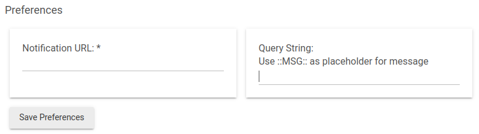

# HTTP Notifications

A [Hubitat Elevation](https://hubitat.com) notification driver to send notficiation messages to an HTTP URL. 

This driver is the counterpart to my [MagicMirror²](https://github.com/MichMich/MagicMirror) module named [MMM-HomeAutomationNotifications](https://github.com/john3300/MMM-HomeAutomationNotifications) for displaying notifications. However the implementation is not specific to MagicMirror and can be used for any kind of notification target.

## Preferences

- **Notification URL:** (Required) Where to send your notifications to.
- **Query String:** (Optional) Any query parameters you want to send. Use `<MSG>` as a placeholder for the notification message.

Only the message will be URL encoded before it's sent. If your query string needs encoding you will need to do that on your own.

### Example values

|Preference|Value|
|--|--|
|Notification URL|`http://magicmirror:8080/MMM-HomeAutomationNotifications`|
|Query String|`type=WARNING&message=<MSG>`|

## Using the driver

1. Add a virtual device and select HTTP Notifications as the type.
2. Configure the device to set your preferences.
3. Now you can select the device as your target for text notifications in an app such as the built-in Notifications app.